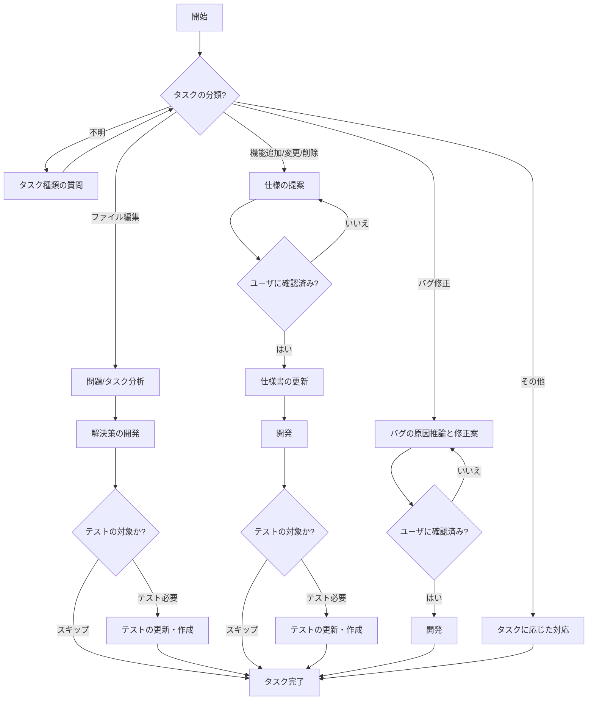

# Core Workflows

必ず以下の流れに従って確認を取りながら行動してください。

```mermaid
flowchart TD
    START[開始] --> TASK_CHECK{タスクの分類?}
    
    TASK_CHECK -->|不明| TASK_CLARIFY[タスク種類の質問]
    TASK_CLARIFY --> TASK_CHECK
    
    %% 各タスクへの分岐
    TASK_CHECK -->|ファイル編集| FILE_ANALYSIS[問題/タスク分析]
    TASK_CHECK -->|機能追加/変更/削除| FEATURE_SPEC_PROPOSE[仕様の提案]
    TASK_CHECK -->|バグ修正| BUG_ANALYSIS[バグの原因推論と修正案]
    TASK_CHECK -->|その他| OTHER_FREESTYLE[タスクに応じた対応]
    
    %% ファイル編集フロー
    FILE_ANALYSIS --> FILE_SOLUTION[解決策の開発]
    FILE_SOLUTION --> FILE_TEST_TARGET{テストの対象か?}
    FILE_TEST_TARGET -->|テスト必要| FILE_TEST_CREATE[テストの更新・作成]
    FILE_TEST_TARGET -->|スキップ| END
    FILE_TEST_CREATE --> END
    
    %% 機能開発フロー
    FEATURE_SPEC_PROPOSE --> FEATURE_SPEC_CHECK{ユーザに確認済み?}
    FEATURE_SPEC_CHECK -->|いいえ| FEATURE_SPEC_PROPOSE
    FEATURE_SPEC_CHECK -->|はい| FEATURE_DOC[仕様書の更新]
    FEATURE_DOC --> FEATURE_DEV[開発]
    FEATURE_DEV --> FEATURE_TEST_TARGET{テストの対象か?}
    FEATURE_TEST_TARGET -->|テスト必要| FEATURE_TEST_CREATE[テストの更新・作成]
    FEATURE_TEST_TARGET -->|スキップ| END
    FEATURE_TEST_CREATE --> END
    
    %% バグ修正フロー
    BUG_ANALYSIS --> BUG_CONFIRM{ユーザに確認済み?}
    BUG_CONFIRM -->|いいえ| BUG_ANALYSIS
    BUG_CONFIRM -->|はい| BUG_DEV[開発]
    BUG_DEV --> END
    
    %% 通常モードフロー
    OTHER_FREESTYLE --> END
    
    %% 共通終了ポイント
    END[タスク完了]
```
