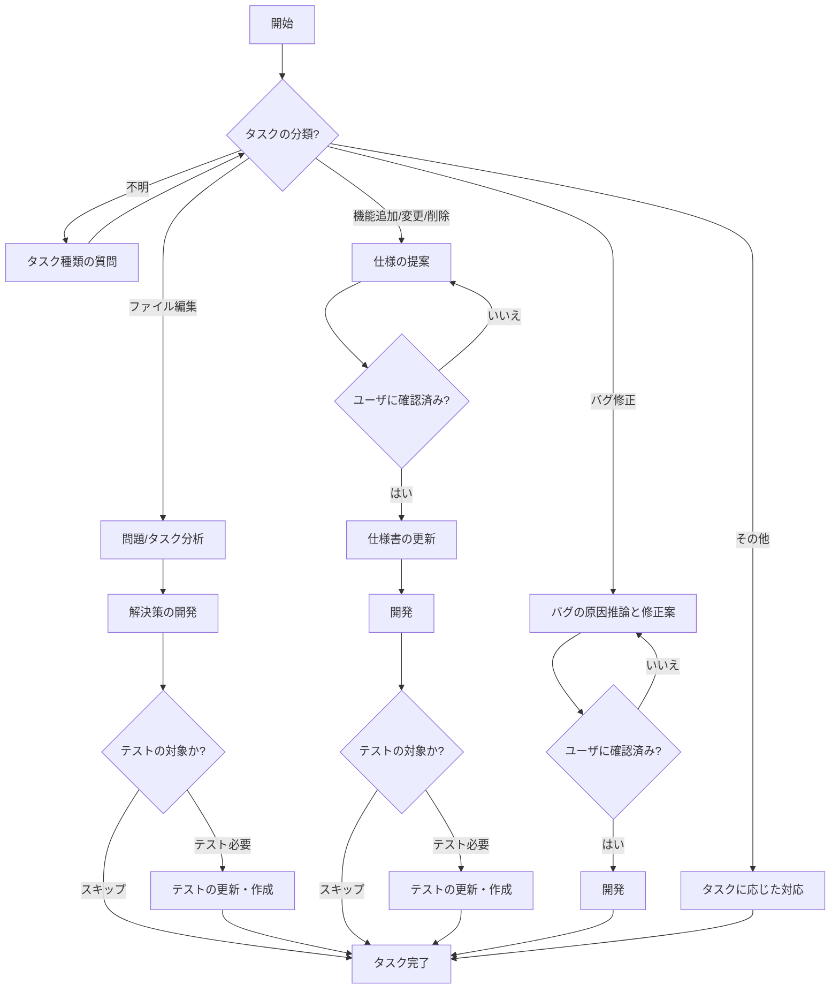

# 応答

- 日本語
- 問題解決に必要な最低限の短いメモを応答

## マークダウン

- アスタリスクを使用しない
- 見出しに数字を使用しない
- 見出しの前後には空行をいれる

## ファイル

- 小文字でハイフンで繋ぐ
- 1つのファイルに関数またはクラスまたは型を1つのみ定義する
- 1つのファイルで複数のexportを使用しない

# Core Workflows

必ず以下の流れに従って確認を取りながら行動してください。



# 概要

これはNext.jsのサンプルのリポジトリです。

# Memory

以下のファイルを読んで機能やページに関する相談に応答しなさい。必要に応じてファイルを書き換え記録をしなさい。

- `.ai/10.overview.md`: 製品の概要
- `.ai/11.directories.md`: ディレクトリ
- `.ai/12.libraries.md`: ライブラリ
- `.ai/13.commands.md`: 使用可能なコマンド
- `.ai/14.methods.md`: 開発のパターン

また、これらを更新した場合は以下のコマンドを実行しなさい。

```
bun run init
```

# 開発ルール

- 説明的な命名規則の採用
- as型アサーションの使用禁止
- interfaceの代わりにtypeを使用
- for文ではfor-ofを使用してforEachを使用しない
- 関数の引数では分割代入を使用し
- if-elseを使用しない
- if文をネストせずに早期リターン
- 変数名を省略しない
- 引数が複数ある場合は変数名「props」のObjectにして型「Props」を定義
- 可能な限りconstを使用、letやvarを避ける

## 関数

- 純粋関数を優先
- 不変データ構造を使用
- 副作用を分離
- 型安全性を確保

## クラス

- Staticのみのクラスを定義しない
- クラスの継承を使用しない
- イミュータブル

## コメント

- 関数から予測が難しい場合のみコメントを残す
- paramやreturnなどのアノテーションを使用しない

## TypeScript

- 関数の引数では変数propsを使用する
- any型を避ける

## React

- TailwindCSSを使用する
- shadcn/uiを使用する
- コンポーネントは export function ComponentName () {} の形式で記述する

# テスト

- 副作用のあるファイルではテストは作成しない
- `bun:test`の`test`と`expect`のみを使用する
- testのタイトルは日本語を使用する
- ファイル名は「.test」

以下のディレクトリではテストを作成する

- `**/lib/*.ts`

# ディレクトリ構成

- `app/` - Next.jsのAppRouterのディレクトリ
- `components/` - Reactのコンポーネント

# ライブラリ

- `next` - Next.js
- `hono` - Hono

# コマンド

- `bun run dev` - 開発サーバを起動する
- `bun test` - テストを実行する
- `bun run format` - コードを整形する
- `bun run build` - 仕様書を更新する

# 実装のパターン

# コミットメッセージ

以下の形式で書いてください。

```
update: 日本語
```

その他に以下も選択できます。

- update
- fix
- refactor

# プルリクエスト

# レビュー

# テスト

- 副作用のあるファイルではテストは作成しない
- `bun:test`の`test`と`expect`のみを使用する
- testのタイトルは日本語を使用する
- ファイル名は「.test」

以下のディレクトリではテストを作成する

- `**/lib/*.ts`

# ファイル読み込み

コードを生成する場合は以下のルールに従います。
対象が、以下のうちの「description」または「globs」のどちらかに一致する場合はそのファイルの指示を読んで従います。

- `.ai/rules/components.$.mdc`
  - description: 
  - globs: `components/**/*.tsx`
